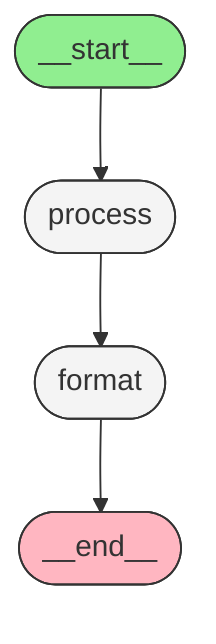

# 09.02.01 - 图基础概念

> LangGraph 用图（Graph）来编排 LLM 驱动的 Agent 流程

## 为什么需要图架构

传统的 LLM 调用是线性的：

```
用户输入 → 模型调用 → 返回结果
```

但真实的 Agent 需要复杂的工作流：

```
┌──────────┐     ┌──────────┐     ┌──────────┐
│  规划    │────→│  执行    │────→│  反思    │
└──────────┘     └──────────┘     └──────────┘
                      │                │
                      ▼                │
                ┌──────────┐           │
                │  工具调用 │───────────┘
                └──────────┘
                      │
                      ▼
                ┌──────────┐
                │  重试/分支│
                └──────────┘
```

LangGraph 的图架构让这种复杂流程变成可组合、可调试的代码。

## LangGraph 的核心思想

```
┌───────────────────────────────────────────────────────────┐
│                    LangGraph 架构                          │
├───────────────────────────────────────────────────────────┤
│                                                           │
│   State（状态）  ←  共享的数据结构，贯穿整个图             │
│       ↑                                                   │
│       │  读取 + 更新                                       │
│       │                                                   │
│   ┌───┴───┐      ┌──────────┐      ┌──────────┐          │
│   │ Node  │─────→│  Node    │─────→│  Node    │          │
│   │ (节点)│      │  (节点)  │      │  (节点)  │          │
│   └───┬───┘      └──────────┘      └──────────┘          │
│       │                                                   │
│       │  决定下一步去哪个节点                               │
│       ▼                                                   │
│   Edges（边）  ←  普通边 / 条件边                          │
│                                                           │
└───────────────────────────────────────────────────────────┘
```

## StateGraph — 图的构建器

`StateGraph` 是 LangGraph 中最常用的图构建器。它需要一个状态类型定义：

```python
from typing import TypedDict
from langgraph.graph import StateGraph

class State(TypedDict):
    messages: list
    counter: int

# 用 State 类型创建图构建器
builder = StateGraph(State)
```

### StateGraph 的类型参数

| 类型 | 说明 | 何时使用 |
|------|------|---------|
| `StateGraph(State)` | 仅状态类型 | 大多数场景 |
| `StateGraph(input=InputState, output=OutputState)` | 输入/输出类型分离 | 对外暴露简化接口 |
| `StateGraph(context=ContextType)` | 带运行时上下文 | 需要共享配置 |

### 完整的图构建流程

```python
from typing import TypedDict
from langgraph.graph import StateGraph, START, END

class State(TypedDict):
    input: str
    result: str
    steps: list

# 1. 创建构建器
builder = StateGraph(State)

# 2. 添加节点
builder.add_node("process", process_node)
builder.add_node("format", format_node)

# 3. 添加边
builder.add_edge(START, "process")      # 从起点开始
builder.add_edge("process", "format")   # 顺序执行
builder.add_edge("format", END)         # 到终点结束

# 4. 编译为可执行的图
graph = builder.compile()
```

## 三要素详解

### 要素一：State（状态）

State 是贯穿整个图的生命周期中的共享数据结构。

```python
from typing import TypedDict

class ChatState(TypedDict):
    messages: list          # 对话历史
    current_topic: str      # 当前话题
    confidence: float       # 置信度
    needs_human_review: bool  # 是否需要人工审核
```

**关键特性：**

- 每个节点可以读取 State 中的任意字段
- 每个节点通过返回 `dict` 来更新 State
- 更新是**合并**（merge）而非覆盖

```python
def analyze_node(state: ChatState) -> dict:
    # 读取 state 中的 messages
    last_message = state["messages"][-1]
    
    # 只返回需要更新的字段
    return {
        "current_topic": "python",
        "confidence": 0.95,
    }
    # needs_human_review 保持不变
```

### 要素二：Nodes（节点）

节点是执行实际工作的函数：

```python
def process_node(state: State) -> dict:
    """处理输入数据"""
    result = state["input"].strip().lower()
    return {"result": result}
```

**节点的特性：**

| 特性 | 说明 |
|------|------|
| 输入 | 接收当前 State |
| 输出 | 返回 `dict`（要更新的字段） |
| 执行顺序 | 由边（Edges）决定 |
| 可并行 | 无依赖的节点可以并行执行 |

### 要素三：Edges（边）

边决定执行流程。有两种类型：

```
┌─────────────────────┐
│   普通边 (Edge)      │
│   A ────→ B         │  总是从 A 到 B
└─────────────────────┘

┌─────────────────────┐
│   条件边 (Conditional)│
│   A ───→ B 或 C     │  根据函数返回值决定
└─────────────────────┘
```

```python
# 普通边 — 总是执行
builder.add_edge("step_a", "step_b")

# 条件边 — 根据逻辑决定
def route(state: State) -> str:
    if state["confidence"] > 0.8:
        return "approve"
    return "review"

builder.add_conditional_edges("analyze", route, {
    "approve": "approve_node",
    "review": "review_node",
})
```

## 编译图 — compile()

图构建完成后，必须调用 `compile()` 才能执行：

```python
graph = builder.compile()
```

`compile()` 做了什么？

```
┌─────────────┐     compile()     ┌──────────────────────┐
│  StateGraph │ ──────────────→  │  CompiledGraph        │
│  Builder    │                  │  (可执行)              │
│             │                  │                       │
│  - 节点定义  │                  │  - 验证图结构           │
│  - 边定义    │                  │  - 创建执行引擎         │
│  - 状态类型  │                  │  - 准备状态管理         │
└─────────────┘                  └──────────────────────┘
```

编译时会验证：
1. 每个节点是否已注册
2. 是否有从 START 出发的路径
3. 是否有到达 END 的路径（或者允许循环）
4. 条件边的返回值是否映射到有效节点

## 执行图

编译后的图支持多种调用方式：

### invoke（单次执行）

```python
result = graph.invoke({"input": "Hello World"})
print(result)
# {'input': 'Hello World', 'result': 'hello world', 'steps': []}
```

### stream（流式执行）

```python
for event in graph.stream({"input": "Hello"}):
    print(event)
# {'process': {'result': 'hello'}}
# {'format': {'output': 'Processed: hello'}}
```

### ainvoke / astream（异步版本）

```python
result = await graph.ainvoke({"input": "Hello"})

async for event in graph.astream({"input": "Hello"}):
    print(event)
```

## Pregel 执行模型

LangGraph 的底层执行引擎叫 **Pregel**（灵感来自 Google 的 Pregel 图处理系统）。

### Pregel 的核心：Super Step（超步）

```
Super Step 1              Super Step 2              Super Step 3
──────────────           ──────────────           ──────────────

┌──────────┐
│  Node A  │  执行完毕，更新 State
└──────────┘
      │
      ▼  State 更新同步
┌──────────┐
│  Node B  │  读取更新后的 State
└──────────┘
```

**Super Step 规则：**

1. **同步屏障**：所有活动节点在同一超步中并行执行
2. **状态隔离**：节点只能读取超步开始时的 State
3. **更新累积**：所有节点的更新在超步结束时合并
4. **下一超步**：合并后的 State 传递给下一超步的节点

```
时间线：
──────────────────────────────────────────────────────────→

超步 1: [Node A] [Node B]  ← 并行执行
         │         │
         └────┬────┘
              ▼  State 合并
              
超步 2:      [Node C]       ← 读取合并后的 State
              │
              ▼  State 更新
              
超步 3:      [Node D]
```

### 示例：理解 Super Step

```python
from typing import TypedDict
from langgraph.graph import StateGraph, START, END

class State(TypedDict):
    value: int

def add_one(state: State) -> dict:
    new_val = state["value"] + 1
    print(f"add_one: {state['value']} → {new_val}")
    return {"value": new_val}

def double(state: State) -> dict:
    new_val = state["value"] * 2
    print(f"double: {state['value']} → {new_val}")
    return {"value": new_val}

def square(state: State) -> dict:
    new_val = state["value"] ** 2
    print(f"square: {state['value']} → {new_val}")
    return {"value": new_val}

builder = StateGraph(State)
builder.add_node("add_one", add_one)
builder.add_node("double", double)
builder.add_node("square", square)
builder.add_edge(START, "add_one")
builder.add_edge("add_one", "double")
builder.add_edge("double", "square")
builder.add_edge("square", END)

graph = builder.compile()
result = graph.invoke({"value": 3})
print(f"最终结果: {result['value']}")

# 输出:
# add_one: 3 → 4
# double: 4 → 8
# square: 8 → 64
# 最终结果: 64
```

## StateGraph vs 其他构建器

LangGraph 提供多种图构建器：

| 构建器 | 说明 | 适用场景 |
|--------|------|---------|
| `StateGraph` | 基于状态的图 | 大多数场景（最常用） |
| `MessageGraph` | 仅处理消息列表 | 简单对话 |
| `CommandGraph` | 支持 Command 路由 | 复杂路由逻辑 |

```python
# MessageGraph — 简化版，只处理消息
from langgraph.graph import MessageGraph

builder = MessageGraph()
builder.add_node("reply", reply_node)
builder.add_edge(START, "reply")
builder.add_edge("reply", END)
```

## 图的可视化

编译后的图可以生成 Mermaid 流程图：

```python
graph = builder.compile()
print(graph.get_graph().draw_mermaid())
```

输出示例：



## 错误处理

### 常见编译错误

```python
# 错误1：缺少 START 边
builder = StateGraph(State)
builder.add_node("process", process_node)
builder.add_edge("process", END)
# 编译会失败 — 没有从 START 出发的路径

# 错误2：条件边引用不存在的节点
def route(state) -> str:
    return "unknown_node"  # 该节点未注册

builder.add_conditional_edges("start", route)
# 运行时会报错

# 错误3：节点返回非 dict
def bad_node(state):
    return "not a dict"  # 应该返回 dict
```

### 调试技巧

```python
# 查看图的节点列表
print(graph.get_graph().nodes)

# 查看图的边列表
print(graph.get_graph().edges)

# 查看完整图结构（ASCII）
from IPython.display import display, Image
display(Image(graph.get_graph().draw_mermaid_png()))
```

## 实战：简单的数据处理管道

```python
from typing import TypedDict
from langgraph.graph import StateGraph, START, END

class DataState(TypedDict):
    raw: str
    cleaned: str
    tokens: list
    result: str

def clean_node(state: DataState) -> dict:
    text = state["raw"].lower().strip()
    text = "".join(c for c in text if c.isalnum() or c.isspace())
    return {"cleaned": text}

def tokenize_node(state: DataState) -> dict:
    tokens = state["cleaned"].split()
    return {"tokens": tokens}

def analyze_node(state: DataState) -> dict:
    word_count = len(state["tokens"])
    char_count = sum(len(t) for t in state["tokens"])
    return {"result": f"单词数: {word_count}, 字符数: {char_count}"}

builder = StateGraph(DataState)
builder.add_node("clean", clean_node)
builder.add_node("tokenize", tokenize_node)
builder.add_node("analyze", analyze_node)

builder.add_edge(START, "clean")
builder.add_edge("clean", "tokenize")
builder.add_edge("tokenize", "analyze")
builder.add_edge("analyze", END)

graph = builder.compile()

result = graph.invoke({
    "raw": "  Hello   World!  This  is  LangGraph.  ",
    "cleaned": "",
    "tokens": [],
    "result": "",
})
print(result["result"])  # 单词数: 6, 字符数: 31
```

## 小结

| 概念 | 说明 |
|------|------|
| `StateGraph` | 图构建器，定义状态类型 |
| State | 贯穿图生命周期的共享数据（TypedDict） |
| Nodes | 执行工作的函数，接收 State 返回更新 dict |
| Edges | 决定执行流程（普通边 / 条件边） |
| `START` / `END` | 特殊的入口和出口节点 |
| `compile()` | 将构建器编译为可执行的图 |
| Pregel | 底层执行引擎，基于 Super Step 模型 |
| Super Step | 同步屏障，并行执行 → 合并状态 → 下一步 |

## 练习题

1. 创建一个包含 3 个节点的线性图，分别执行：字符串反转 → 大写转换 → 添加前缀
2. 创建一个条件路由的图：如果输入长度 > 10 走"长文本处理"节点，否则走"短文本处理"节点
3. 用 `stream()` 观察上面两个图的执行过程，理解 Super Step 的执行顺序
