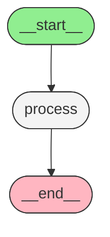
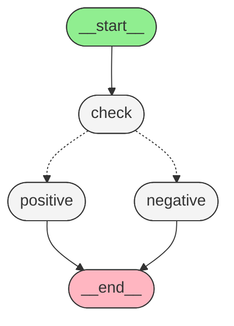

# 09.02.07 - 可视化与调试

> 可视化让你理解图结构，调试让你理解图行为

## 可视化的两个层次

```
┌───────────────────────────────────────────────────┐
│                  可视化层次                         │
│                                                   │
│  1. 静态结构可视化                                  │
│     - 图长什么样？有哪些节点和边？                   │
│     - Mermaid / ASCII / PNG                        │
│                                                   │
│  2. 动态行为追踪                                    │
│     - 图执行时发生了什么？                          │
│     - LangSmith / stream 事件                      │
└───────────────────────────────────────────────────┘
```

## 获取图结构

编译后的图对象提供了多种获取结构信息的方法：

```python
from langgraph.graph import StateGraph, START, END

class State(TypedDict):
    input: str
    output: str

builder = StateGraph(State)
builder.add_node("process", lambda s: {"output": s["input"].upper()})
builder.add_edge(START, "process")
builder.add_edge("process", END)

graph = builder.compile()

# 获取图对象
graph_obj = graph.get_graph()
```

### 查看节点

```python
graph_obj = graph.get_graph()

for node_id, node in graph_obj.nodes.items():
    print(f"节点: {node_id}")
    # 节点: __start__
    # 节点: process
    # 节点: __end__
```

### 查看边

```python
for edge in graph_obj.edges:
    print(f"边: {edge.source} → {edge.target}")
    # 边: __start__ → process
    # 边: process → __end__
```

## Mermaid 可视化

### Mermaid 文本格式

```python
mermaid_code = graph.get_graph().draw_mermaid()
print(mermaid_code)
```

输出示例：



### 条件分支的 Mermaid 输出

```python
from typing import TypedDict
from langgraph.graph import StateGraph, START, END

class State(TypedDict):
    value: int

def check(state: State) -> str:
    return "positive" if state["value"] > 0 else "negative"

def positive_node(state: State) -> dict:
    return {"result": "正数"}

def negative_node(state: State) -> dict:
    return {"result": "负数"}

builder = StateGraph(State)
builder.add_node("check", check)
builder.add_node("positive", positive_node)
builder.add_node("negative", negative_node)
builder.add_edge(START, "check")
builder.add_conditional_edges("check", check, {
    "positive": "positive",
    "negative": "negative",
})
builder.add_edge("positive", END)
builder.add_edge("negative", END)

graph = builder.compile()
print(graph.get_graph().draw_mermaid())
```

输出：



注意条件边用虚线 `-.->` 表示。

### 渲染为 PNG（需要 graphviz）

```python
# 需要安装 graphviz: brew install graphviz
png_data = graph.get_graph().draw_mermaid_png()

# 保存到文件
with open("graph.png", "wb") as f:
    f.write(png_data)
```

### 在 Jupyter 中显示

```python
from IPython.display import Image, display

display(Image(graph.get_graph().draw_mermaid_png()))
```

## Stream 模式 — 观察执行过程

### 基本 stream

```python
graph = builder.compile()

for event in graph.stream({"value": 5}):
    print(event)
```

输出：

```
{'check': 'positive'}
{'positive': {'result': '正数'}}
```

每个事件格式：`{节点名: 节点返回值}`

### stream_mode — 不同粒度的事件

```python
# 默认模式 — 每个节点完成后输出
for event in graph.stream(input_data):
    ...

# values 模式 — 每次 State 更新后输出完整 State
for event in graph.stream(input_data, stream_mode="values"):
    print(event)
    # {'value': 5, 'result': ''}
    # {'value': 5, 'result': '正数'}

# updates 模式 — 只输出节点更新
for event in graph.stream(input_data, stream_mode="updates"):
    print(event)
    # {'check': 'positive'}
    # {'positive': {'result': '正数'}}
```

### stream_mode 对比

| 模式 | 输出内容 | 适用场景 |
|------|---------|---------|
| 默认 / `updates` | `{节点名: 返回值}` | 调试单个节点行为 |
| `values` | 完整 State | 观察数据流转 |
| `messages` | LLM 消息事件 | 流式对话 |
| `debug` | 详细执行信息 | 深度调试 |
| `custom` | 节点自定义事件 | 高级场景 |

### debug 模式

```python
for event in graph.stream(input_data, stream_mode="debug"):
    print(f"类型: {event['type']}")
    print(f"节点: {event.get('node')}")
    print(f"数据: {event.get('data')}")
    print("---")
```

debug 事件类型：

| 事件类型 | 说明 |
|---------|------|
| `task` | 任务开始 |
| `task_result` | 任务结束 |
| `checkpoint` | 检查点创建 |

### messages 模式（流式对话）

```python
for event in graph.stream(
    {"messages": [HumanMessage("你好")]},
    stream_mode="messages",
):
    content, metadata = event
    print(content, end="", flush=True)
```

## LangSmith 追踪

LangSmith 是 LangChain/LangGraph 的官方调试和监控平台。

### 配置 LangSmith

```bash
# 设置环境变量
export LANGSMITH_API_KEY="your-api-key"
export LANGSMITH_TRACING="true"
export LANGSMITH_PROJECT="my-langgraph-project"
```

或者在代码中设置：

```python
import os

os.environ["LANGSMITH_API_KEY"] = "your-api-key"
os.environ["LANGSMITH_TRACING"] = "true"
os.environ["LANGSMITH_PROJECT"] = "my-langgraph-project"
```

### 在图执行中追踪

```python
# 配置好 LangSmith 后，自动追踪
result = graph.invoke({"input": "test"})
# 可以在 LangSmith UI 中看到：
# - 完整的执行轨迹
# - 每个节点的输入/输出
# - LLM 调用的 token 使用
# - 执行时间
```

### 添加自定义元数据

```python
result = graph.invoke(
    {"input": "test"},
    config={
        "metadata": {
            "user_id": "123",
            "experiment": "A/B test",
        },
        "tags": ["production", "v2"],
    },
)
```

## 使用 print() 调试

最简单有效的调试方式：

```python
def debug_node(state: State) -> dict:
    print(f"[debug_node] 输入: {state}")
    result = do_something(state["input"])
    print(f"[debug_node] 输出: {result}")
    return {"output": result}
```

### 统一的日志节点

```python
def log_node(state: State) -> dict:
    """插入到关键节点之间，打印 State 快照"""
    import json
    
    # 打印 State 的关键字段
    log_data = {
        k: v for k, v in state.items()
        if k not in ("messages",)  # 跳过大的字段
    }
    print(f"[State] {json.dumps(log_data, indent=2, ensure_ascii=False)}")
    
    return {}  # 不修改 State
```

## 使用 pprint 打印执行过程

```python
from pprint import pprint

for event in graph.stream(input_data, stream_mode="values"):
    pprint(event)
    print("=" * 40)
```

## 断点调试 — 中断执行

LangGraph 支持在执行过程中设置断点：

```python
# 在特定节点前中断
for event in graph.stream(
    input_data,
    interrupt_before=["tool_node"],
):
    print(event)

# 中断后可以检查 State
state = graph.get_state(config)
print(state.values)

# 修改 State 后继续
graph.update_state(config, {"input": "modified_value"})
graph.invoke(None, config)  # 从断点继续
```

### 中断的使用场景

| 场景 | 方法 |
|------|------|
| 工具调用前人工审批 | `interrupt_before=["tool_node"]` |
| 输出前人工审核 | `interrupt_before=[END]` |
| 调试特定节点 | `interrupt_before=["problematic_node"]` |

## 实战：带可视化与调试的完整示例

```python
from typing import Annotated, TypedDict
from operator import add
from langgraph.graph import StateGraph, START, END
from langgraph.types import Command
from langgraph.graph.message import add_messages
from langchain.chat_models import init_chat_model
from langchain.messages import HumanMessage, AIMessage, SystemMessage

# ---- State ----
class DebugState(TypedDict):
    messages: Annotated[list, add_messages]
    step_log: Annotated[list, add]

# ---- Nodes ----
def debug_start(state: DebugState) -> dict:
    return {
        "step_log": ["[START] 收到输入"],
    }

def analyze(state: DebugState) -> dict:
    last_msg = state["messages"][-1].content
    return {
        "step_log": [f"[ANALYZE] 分析: {last_msg[:50]}..."],
    }

def generate(state: DebugState) -> dict:
    model = init_chat_model("moonshot:moonshot-v1-8k")
    response = model.invoke([
        SystemMessage("你是一个有帮助的助手。"),
    ] + state["messages"])
    return {
        "messages": [response],
        "step_log": ["[GENERATE] 生成回复完成"],
    }

def debug_end(state: DebugState) -> dict:
    return {
        "step_log": [f"[END] 完成，共 {len(state['step_log'])} 步"],
    }

# ---- Build Graph ----
builder = StateGraph(DebugState)
builder.add_node("start", debug_start)
builder.add_node("analyze", analyze)
builder.add_node("generate", generate)
builder.add_node("end", debug_end)

builder.add_edge(START, "start")
builder.add_edge("start", "analyze")
builder.add_edge("analyze", "generate")
builder.add_edge("generate", "end")
builder.add_edge("end", END)

graph = builder.compile()

# ---- 可视化 ----
print("=== 图结构 ===")
print(graph.get_graph().draw_mermaid())

# ---- 执行并观察 ----
print("\n=== 执行过程 (updates 模式) ===")
for event in graph.stream(
    {
        "messages": [HumanMessage("解释 Python 的 GIL")],
        "step_log": [],
    },
    stream_mode="updates",
):
    print(event)

print("\n=== 最终状态 (values 模式) ===")
result = graph.invoke(
    {
        "messages": [HumanMessage("解释 Python 的 GIL")],
        "step_log": [],
    },
    stream_mode="values",
)
for step in result["step_log"]:
    print(step)
```

## 常见调试问题

### 问题 1：节点没有被执行

```
原因：没有边到达该节点
解决：检查 add_edge 和 add_conditional_edges
```

```python
# ❌ 这个节点永远不会执行
builder.add_node("orphan", orphan_node)
# 没有边指向它

# ✅ 添加边
builder.add_edge("previous", "orphan")
```

### 问题 2：条件路由不工作

```
原因：路由函数返回值不在映射中
解决：检查返回值与映射的 key 是否匹配
```

```python
def route(state) -> str:
    return "unknown"  # ❌ 这个值不在映射中

builder.add_conditional_edges("node", route, {
    "a": "node_a",
    "b": "node_b",
    # "unknown" 不在这里！
})
```

### 问题 3：State 更新丢失

```
原因：节点返回了不存在的字段
解决：检查 State 定义
```

```python
class State(TypedDict):
    messages: list

def bad_node(state: State) -> dict:
    return {"nonexistent": "value"}  # ❌ 字段不存在
```

### 问题 4：循环导致递归限制错误

```
原因：条件边总是指向同一个节点
解决：添加退出条件
```

```python
def loop_node(state: State) -> Command:
    if state["done"]:
        return Command(goto=END)
    return Command(goto="loop_node")
```

## 调试检查清单

```
┌────────────────────────────────────────────────┐
│               调试检查清单                       │
│                                                │
│  □ 图结构是否正确？(get_graph())               │
│  □ 所有节点都有入边？                           │
│  □ 有条件边的节点能到达 END 吗？                │
│  □ State 字段拼写正确？                         │
│  □ 节点返回 dict？                              │
│  □ 路由函数返回值匹配映射？                     │
│  □ 递归限制是否足够？                           │
│  □ 条件边的返回类型是 Literal 吗？              │
│  □ stream 输出是否符合预期？                    │
└────────────────────────────────────────────────┘
```

## 小结

| 工具 | 用途 | 方法 |
|------|------|------|
| `get_graph()` | 获取图结构 | `graph.get_graph().nodes/edges` |
| `draw_mermaid()` | Mermaid 流程图 | 渲染为文本或图片 |
| `stream()` | 观察执行过程 | 多种 stream_mode |
| `stream_mode="values"` | 查看 State 变化 | 完整 State 快照 |
| `stream_mode="debug"` | 深度调试 | 任务/检查点事件 |
| LangSmith | 生产监控 | 环境变量配置 |
| `interrupt_before` | 断点调试 | 暂停执行 |
| `print()` | 简单调试 | 节点内打印 |

## 练习题

1. 创建一个图并用 `draw_mermaid()` 生成可视化，用 Mermaid 在线渲染器查看
2. 使用 `stream_mode="values"` 观察 State 在每个节点后的变化
3. 使用 `interrupt_before` 在一个 Agent 的工具调用节点前暂停，检查 State 后继续
4. 配置 LangSmith 追踪并观察一次完整执行的详细报告
